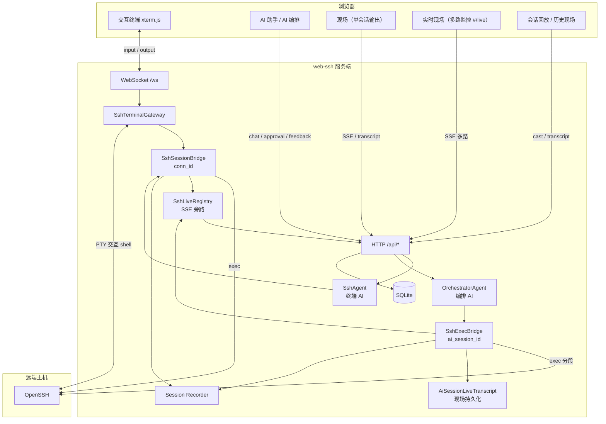
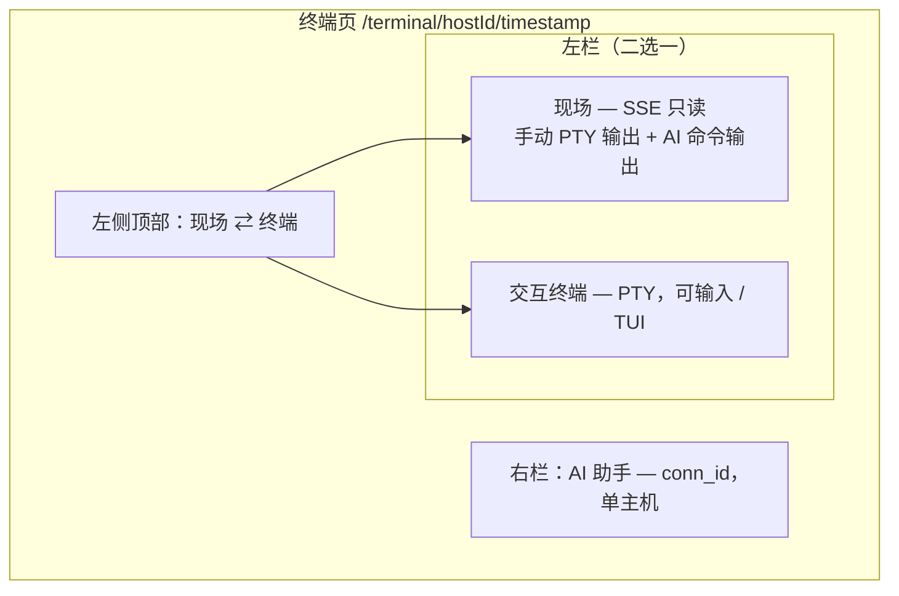
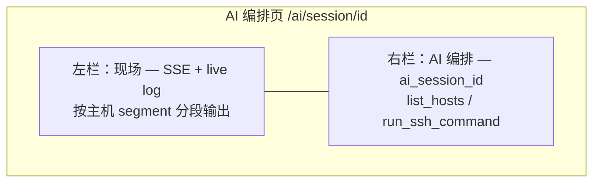
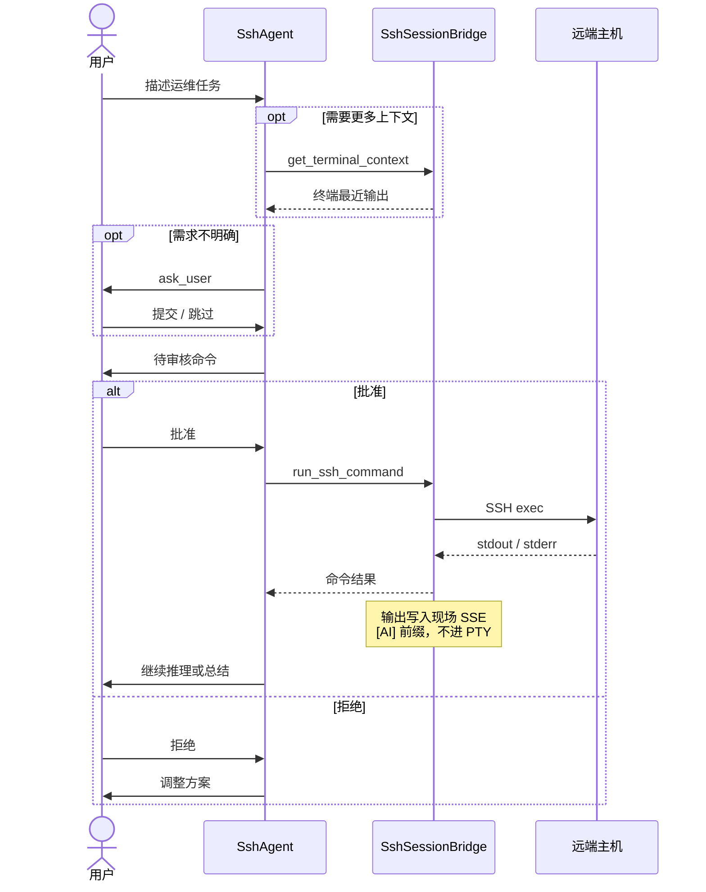
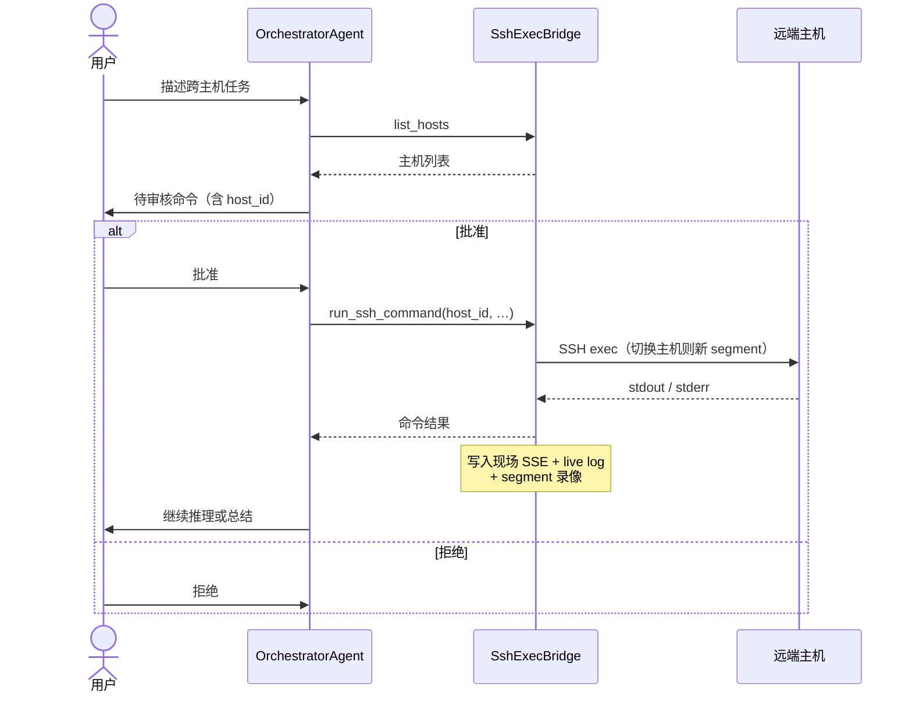
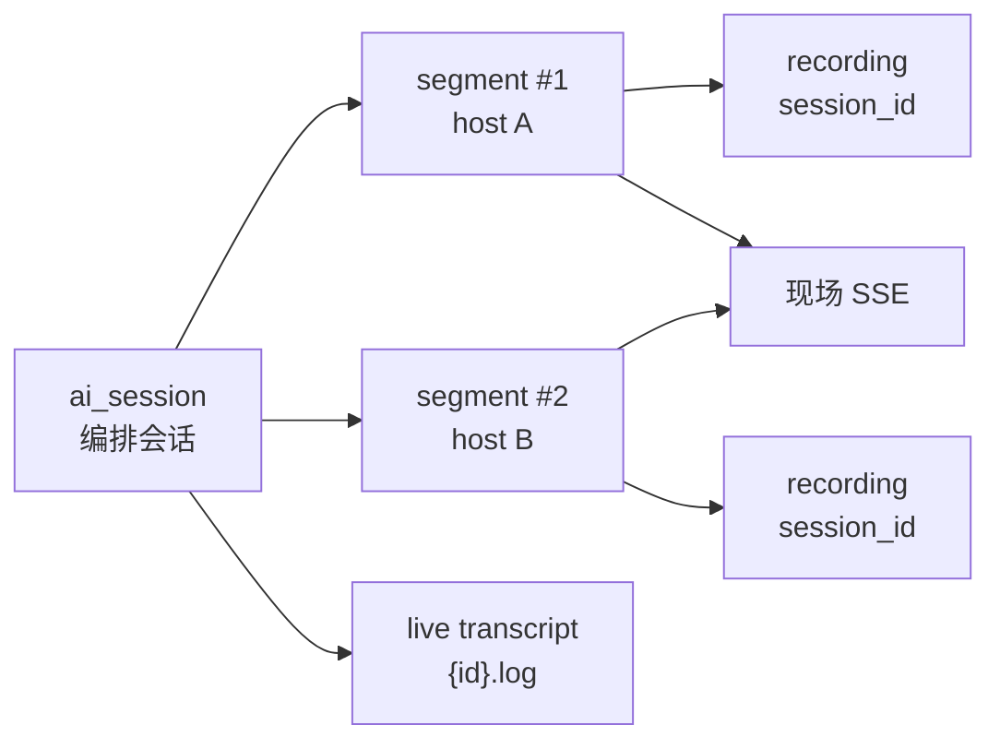

# reactphp-x/web-ssh

浏览器里的 SSH 终端与管理平台。集中管理主机凭据、多标签 Web 终端、AI 辅助运维、实时旁路、现场查看与会话回放。

## 解决的问题

运维或开发经常需要在浏览器可及的环境里操作远端服务器，常见痛点包括：

- **本地终端受限** — 换设备、无 VPN、或防火墙不允许直连 22 端口时，难以快速登录
- **凭据分散** — 多台主机的地址、账号、密钥散落在各处，缺少统一入口
- **跳板机链路复杂** — 经堡垒机/多级跳转连接时，手工维护 `~/.ssh/config` 容易出错
- **协作与监管** — 需要查看「谁连了哪台机器、做了什么」，纯 SSH 客户端难以留痕
- **暴露面风险** — 把 SSH 直接暴露到公网不安全，需要登录鉴权、审计与访问控制
- **重复劳动** — 查日志、看磁盘、改配置等常见任务，希望用自然语言描述后由系统提议命令

本项目提供一个 **自托管的 Web SSH 网关**：

1. 在浏览器里打开终端，无需安装本地 SSH 客户端
2. 集中管理主机与加密存储的凭据，支持跳板机一键连接
3. 可选 **AI 助手**（单主机）或 **AI 编排**（跨主机）：描述任务 → 审核命令 → 自动 exec 并继续推理
4. **现场**查看单次会话输出，**实时现场**监控多路连接；结束后可现场滚动查看或 asciinema 回放
5. 通过 Basic Auth + TOTP 双因子、速率限制与 Cookie 策略控制访问

适合内网运维面板、开发跳板、小团队服务器管理等场景。**不应未经防护直接暴露到公网。**

## 功能概览

| 模块 | 说明 |
|---|---|
| **主机管理** | SQLite 存储主机、分组、标签；密码/私钥加密保存，支持跳板机 |
| **Web 终端** | xterm.js 多标签 **PTY**，OpenSSH 子进程连接远端；支持 TUI（vim、htop、Claude Code 等） |
| **AI 助手** | 终端页侧栏；绑定单主机 `conn_id`，自然语言描述任务，**批准后才执行**命令 |
| **AI 编排** | 独立跨主机会话（`#/ai`）；无需先开终端，`list_hosts` 选机、`run_ssh_command` 分段 exec，左侧 **现场** 持久化输出 |
| **现场** | 终端页 / AI 编排页左栏：查看当前会话输出（手动输入 + AI 命令）；AI 编排支持持久化 transcript，刷新后可恢复 |
| **实时现场** | 左侧菜单 `#/live`：多路 SSE 旁路监控**进行中**的 SSH 连接（只读，不可输入） |
| **会话记录** | 连接起止、状态、耗时；自动写入 asciinema cast（`storage/recordings/`） |
| **现场查看** | 会话记录 / AI 会话历史中，以只读终端滚动查看完整输出（非定时回放） |
| **会话回放** | 对已结束会话播放 asciinema 录像；多分片、进度控制、窗口自适应 |
| **操作审计** | 主机增删改、AI 命令批准/拒绝等 API 操作日志 |
| **登录鉴权** | HTTP Basic Auth + TOTP 双因子（可选 Cookie 登录页） |

### 系统交互概览

GitHub 可直接渲染下方 [Mermaid](https://github.blog/2022-02-14-include-diagrams-markdown-files-mermaid/) 图；本地预览需支持 Mermaid 的 Markdown 编辑器（如 VS Code 插件）。

**整体架构** — 浏览器经 WebSocket 驱动交互终端（PTY），经 HTTP 驱动 AI、现场与实时旁路；AI 命令走独立 SSH exec，与 PTY 互不干扰：



**终端页布局** — 登录与 AI 助手进入同一页面；左侧可在 **现场** 与交互终端间切换，右侧为 AI 对话：



**AI 编排页布局** — 不绑定单主机；左侧 **现场** 持久化 transcript，右侧跨主机对话：



**终端 AI 工作流** — 绑定 `conn_id`；只读工具自动执行，`run_ssh_command` 须人工批准：



**编排 AI 工作流** — 绑定 `ai_session_id`；可跨主机切换 segment，每场独立录像：



> AI 命令输出以 `[AI] $ command` 形式写入**现场** SSE 流，不会混入左侧交互终端。

### 终端、AI、现场、实时现场、回放怎么选？

| 你想做什么 | 用哪个 |
|---|---|
| 亲手输入命令、跑 TUI 程序 | **Web 终端**（PTY） |
| 用自然语言让 AI 提议并执行 shell 命令 | **AI 助手**（需逐条批准） |
| 当前连接里看手动输入 + AI 命令的实际输出 | 终端页左侧 **现场** |
| 跨主机 AI 编排，刷新后继续看命令输出 | **AI 编排** → 左侧 **现场**（持久化 transcript） |
| 同时监控多路进行中的 SSH 连接 | 菜单 **实时现场**（`#/live` 监控墙） |
| 事后一次性滚动查看某次连接完整输出 | **会话记录 → 现场** |
| 事后按时间轴播放终端录像 | **会话记录 → 回放** |
| AI 跑命令时对照实际输出 | **AI 助手** + 左侧切到 **现场** |

> **PTY 与 AI exec 是两条通道**：你在终端里的交互 shell（`cd`、环境变量、TUI）与 AI 执行的命令**相互独立**。AI 每次命令走独立 SSH exec，输出带 `[AI]` 前缀写入**现场**流，**不会**混进你的交互终端。

### TUI 与远端 AI 开发工具

终端基于 **真实 PTY**，支持键盘交互、颜色与窗口缩放，可在远端 shell 中运行：

- **[Claude Code](https://docs.anthropic.com/en/docs/claude-code)** — `claude` 等命令行 AI 编程助手
- **[Cursor Agent](https://cursor.com)** — 远端通过 SSH 使用 Cursor CLI / Agent 工作流

连接后在**左侧终端**里像本地一样启动即可；窗口大小变化会通过 `resize` 同步到 PTY。内置 **AI 助手**是另一套能力，用于「描述任务 → 审核命令 → 自动 exec」，不替代上述 TUI 工具。

## 技术栈

| 层 | 组件 |
|---|---|
| 运行时 | [reactphp-x/framework](https://github.com/reactphp-x/framework) + [reactphp-x/worker](https://github.com/reactphp-x/worker) |
| WebSocket | [reactphp-x/websocket-group](https://github.com/reactphp-x/websocket-group) |
| SSH | 系统 `openssh-client`（PTY + 独立 exec 通道） |
| AI | [neuron-core/neuron-ai](https://github.com/neuron-core/neuron-ai) |
| 前端 | Vue 3 + [xterm.js](https://xtermjs.org/) + [asciinema-player](https://github.com/asciinema/asciinema-player) |
| 存储 | SQLite（`ext-sqlite3`） |
| 可选 | Redis（多 Worker 时 AI 线程锁 / SSE 状态） |
| 2FA | [wpjscc/twofactorauth](https://github.com/wpjscc/twofactorauth) + Bacon QR Code |

## 要求

- PHP 8.2+
- 扩展：`ext-sqlite3`、`pcntl`、`posix`
- 系统：`openssh-client`（Docker 镜像已包含）
- Linux / macOS（Worker 模式不支持 Windows）
- Composer 2.x

## 安装

```bash
git clone <repo> web-ssh
cd web-ssh
composer install
cp .env.example .env
```

编辑 `.env`，至少设置：

```env
APP_KEY=base64:...          # 32 字节，用于加密主机凭据与 Cookie 签名
BASIC_AUTH_USER=admin
BASIC_AUTH_PASSWORD=change-me
```

生成 `APP_KEY`：

```bash
php -r "echo 'base64:'.base64_encode(random_bytes(32)).PHP_EOL;"
```

## 启动

```bash
php start.php start          # 前台
php start.php start -d       # 后台
php start.php stop
php start.php restart
php start.php status
```

默认监听地址由 `HTTP_LISTEN` 决定（`.env.example` 为 `0.0.0.0:8095`）。开发模式下会自动监视 `src/`、`config/`、`public/` 变更并 reload。

## Docker

```bash
docker compose up --build
```

默认映射 **宿主机 8097 → 容器 8097**（可通过 `HTTP_PORT` 修改）。

容器内已配置：

- `HTTP_LISTEN=0.0.0.0:8097`
- `HOME=/home/www-data`
- `SSH_IDENTITY_FILE=/home/www-data/.ssh/id_rsa`
- 宿主机 `~/.ssh` 只读挂载到 `/home/www-data/.ssh`

访问：**http://127.0.0.1:8097/login**

> `docker-compose.yml` 中的 `environment` 会覆盖 `.env` 里的 `HTTP_LISTEN`。主机私钥路径请使用容器内路径（如 `~/.ssh/id_rsa`）。

## 快速上手

1. 打开 `/login`，输入平台账号密码
2. 首次使用绑定 TOTP（扫码）；之后每次登录输入 6 位验证码
3. 在 **主机管理** 中新建主机（地址、端口、用户名、密码或私钥、可选跳板机）
4. 进入 **终端** 建立 SSH 会话；主机列表 **登录** 默认左侧为交互终端，**AI 助手** 进入同一终端页但默认左侧为 **现场**
5. 终端页右侧 **AI 助手**（需配置 `NEURON_AI_KEY`）可描述运维任务；**左侧顶部**可切换 **现场 / 终端**（终端可手动输入）
6. 菜单 **实时现场** 可旁路监控多路连接；**会话记录** 中可 **现场** 滚动查看或 **回放** 已结束的录像
7. 侧边栏 **AI 编排**（`#/ai`）可新建跨主机会话：描述任务 → AI 选机并提议命令 → 审核后在远端 exec，无需先打开 Web 终端

未登录访问 `/` 会重定向到 `/login`；点击 **退出** 清除登录与 2FA Cookie。

## AI 助手（终端页）

适用于**已打开某台主机 Web 终端**时的单主机运维辅助。SSH 连接成功后，终端页右侧出现 **AI 助手** 侧栏（移动端为「现场 | AI 助手」或「终端 | AI 助手」标签切换）。从 **主机管理** 点击 **AI 助手** 进入**同一终端页**，默认左侧为 **现场**，右侧为 AI 对话；可在**左侧顶部**切换为 **交互终端** 并手动输入。

绑定 **`conn_id`**（WebSocket `connected` 消息中的 `_id`），复用当前 SSH 连接的凭据与 exec 通道。

### 工作流程

1. 在底部输入框描述任务（如「查看磁盘使用并清理 /tmp」）
2. AI 分析后可调用工具：
   - **`get_terminal_context`** — 读取终端最近输出（只读，**无需审核**）
   - **`run_ssh_command`** — 提议 shell 命令（**必须审核**）
   - **`ask_user`** — 需求不明确时弹出选项（单选/多选）
3. 出现 **待审核命令** 时，在侧栏底部点击 **批准** 或 **拒绝**
4. 批准后通过 **独立 SSH exec** 执行；输出回传 AI 继续推理（可多轮）
5. 点击 **工具调用** 可展开查看每次工具的参数与返回（消息 timeline 与工具卡片交错展示）

### API

均需 Basic Auth + 2FA。

```text
GET  /api/ai/bootstrap?conn_id={conn_id}
POST /api/ai/chat/stream           { conn_id, message }
POST /api/ai/chat/approval/stream  { conn_id, approved: 1|0 }
POST /api/ai/chat/feedback/stream  { conn_id, answers: {} }
POST /api/ai/chat/stop             { conn_id }
POST /api/ai/chat/reset            { conn_id }
```

命令审核记录写入 **操作日志**（`ai.command.approved` / `ai.command.rejected`）。

### 说明与限制

- AI exec 每次为**新 shell 进程**，工作目录/环境可能与交互 PTY 不一致（例如在 PTY 里 `cd` 后，AI 仍可能从 home 执行）
- 不支持交互式命令（vim、top、mysql 客户端等）；请在左侧 PTY 终端手动操作
- 仅 `run_ssh_command` 会触发待审核；只读工具自动执行

## AI 编排

**AI 编排**是独立于 Web 终端的跨主机运维模式：在浏览器里描述任务，由 AI 从平台主机列表中选目标、提议 shell 命令，你审核后自动 SSH exec 执行，并可在多台机器间切换继续推理。**无需先打开某台主机的交互终端**。

典型场景：

- 批量巡检多台服务器（磁盘、负载、服务状态）
- 在 A 机查日志、B 机改配置、C 机重启服务的串联任务
- 离开页面后从历史会话继续，或回看命令输出

### 与终端 AI 助手的区别

| | **终端 AI 助手** | **AI 编排** |
|---|---|---|
| 入口 | 主机管理 → **AI 助手** / 终端页侧栏 | 侧边栏 **AI 编排** |
| 路由 | `#/terminal/{hostId}/…` | `#/ai`、`#/ai/session/{id}`、`#/ai/sessions` |
| 绑定键 | `conn_id`（须先 WebSocket 连上该主机） | `ai_session_id`（独立会话） |
| 选主机 | 固定为当前终端主机 | `list_hosts` 动态选择，可跨主机切换 |
| 左侧 **现场** | 含手动 PTY 输出 + AI 命令 | 仅 AI 命令输出（按 segment 分段） |
| 现场持久化 | 连接期间 SSE；历史靠会话录像 | live log + transcript，刷新可恢复 |
| 录像 | 单次 SSH 会话一条 | 每个主机 segment 独立录像，回放按段顺序播放 |
| Agent | `SshAgent` | `OrchestratorAgent` |

### 页面与路由

| 路由 | 说明 |
|---|---|
| `#/ai` | 新建编排会话入口 |
| `#/ai/session/{id}` | 进行中的编排会话（左 **现场** + 右 AI 对话） |
| `#/ai/sessions` | 历史会话列表：继续 / **现场** / **回放** |

**PC 布局**：左侧 **现场**（命令输出）与右侧 AI 对话之间可**拖动分隔线**调整宽度，比例保存在浏览器 `localStorage`。

**移动端**：「现场 | AI 对话」标签切换，无分栏拖动。

### 核心概念



| 概念 | 说明 |
|---|---|
| **ai_session** | 一次编排对话 thread，对应 SQLite `ai_sessions` 表与聊天文件 `storage/neuron/ai-sessions/neuron_{id}.chat` |
| **segment** | 在某台主机上的一段 exec 生命周期；切换 `host_id` 时结束旧 segment、开启新 segment |
| **live_key** | segment 对应的 SSE 旁路键，供 **现场** 实时推送 |
| **live transcript** | 编排会话全部命令输出的持久化文本，路径 `storage/neuron/ai-sessions/live/{id}.log` |
| **segment 录像** | 每个 segment 对应一条 `sessions` 记录（`session_type=ai_exec`），写入 `storage/recordings/{session_id}/` |

切换主机时，左侧 **现场** 会插入主机分隔线；各 segment 的 shell 环境**相互独立**（cwd、环境变量不共享）。

### 工作流程

1. 侧边栏进入 **AI 编排**，点击 **新建会话**（或从历史列表 **继续**）
2. 在右侧输入任务，例如：「检查 web-01 和 web-02 的 nginx 是否在运行」
3. AI 调用工具（见下表）；遇到 **`run_ssh_command`** 时在底部 **批准 / 拒绝**
4. 批准后 `SshExecBridge` 对该 `host_id` 建立（或复用）exec 连接并执行；输出写入左侧 **现场** 与 live log
5. AI 根据输出继续推理，可切换主机执行下一条命令，直至任务完成
6. 刷新 `#/ai/session/{id}` 后，**现场** 通过 SSE `replay` 事件或 transcript API 恢复；聊天 timeline 含工具卡片

### 编排工具

| 工具 | 需审核 | 说明 |
|---|---|---|
| **`list_hosts`** | 否 | 列出平台已保存主机（id、名称、地址），供 AI 选择目标 |
| **`get_command_context`** | 否 | 读取本编排会话中，某主机上最近 AI 命令输出 |
| **`run_ssh_command`** | **是** | 在指定 `host_id` 上执行一条 shell 命令；参数含 `command`、`reason` |
| **`ask_user`** | 否 | 需求不明确时向用户弹出选项（单选/多选） |

> 编排模式下 **`run_ssh_command` 必须带 `host_id`**；终端 AI 则固定在当前 `conn_id` 对应主机上执行。

### 现场、回放与历史

| 操作 | 入口 | 数据来源 |
|---|---|---|
| 实时看命令输出 | `#/ai/session/{id}` 左侧 **现场** | SSE `/live/stream`（含 `replay`） |
| 刷新后恢复现场 | 同上 | live log；若无 log 则从 segment 录像回填 |
| 历史滚动查看 | `#/ai/sessions` → **现场** | `GET /live/transcript` |
| 按时间轴回放 | `#/ai/sessions` → **回放** | 各 segment 的 asciinema manifest 顺序播放 |

AI 命令在现场中以 `[AI] $ command` / `[AI] exit N` 标记；切换主机时有 `────────── 主机 · … ──────────` 分隔。

### API

均需 Basic Auth + 2FA。路径中的 `{id}` 为 `ai_session_id`。

```text
GET  /api/ai/sessions                              # 分页列表
POST /api/ai/sessions                              # 新建 { title? }
GET  /api/ai/sessions/{id}                         # 会话详情 + segments
GET  /api/ai/sessions/{id}/bootstrap               # 聊天 bootstrap（含 timeline）
POST /api/ai/sessions/{id}/chat/stream             { message }
POST /api/ai/sessions/{id}/approval/stream         { approved: 1|0 }
POST /api/ai/sessions/{id}/feedback/stream         { answers: {} }
POST /api/ai/sessions/{id}/stop
POST /api/ai/sessions/{id}/reset
GET  /api/ai/sessions/{id}/live/stream             # 现场 SSE（replay / output / segment_switch）
GET  /api/ai/sessions/{id}/live/transcript         # 持久化现场文本
GET  /api/ai/sessions/{id}/recording               # 各 segment 录像 manifest 汇总
```

创建、命令批准/拒绝等操作写入 **操作日志**（如 `ai.session.created`、`ai.command.approved`）。

### 说明与限制

- **无需 Web 终端**：编排 exec 由服务端直接 `openssh` 连接，不占用浏览器 WebSocket PTY
- **每次 exec 是新 shell**：与终端 AI 相同，不要假设 `cd` 或 export 会跨命令保留；需要时用绝对路径或一条命令写完
- **禁止交互式命令**：vim、top、mysql、ssh 等会被拒绝；TUI 请在 Web 终端 PTY 中手动操作
- **主机须预先录入**：只能对 **主机管理** 中已配置的主机执行；AI 通过 `list_hosts` 获取列表
- **单用户隔离**：会话按登录用户名隔离，只能访问自己的 `ai_session`

## AI 配置（共用）

终端 **AI 助手** 与 **AI 编排** 共用以下环境变量（须设置 `NEURON_AI_KEY`）：

```env
AI_ENABLED=true
NEURON_AI_KEY=sk-...
NEURON_AI_MODEL=gpt-4o-mini
# NEURON_AI_PROVIDER=openai
# NEURON_AI_BASE_URL=https://api.deepseek.com/v1
NEURON_AI_HTTP_TIMEOUT=120
AI_COMMAND_TIMEOUT=30
NEURON_AI_TOOL_MAX_RUNS=30    # 单轮对话工具调用上限（默认 30）
REDIS_URL=127.0.0.1:6379      # HTTP_WORKERS>1 时建议配置
```

## 现场与实时现场

「**现场**」和「**实时现场**」是两个不同入口，不要混用：

| 名称 | 入口 | 用途 |
|---|---|---|
| **现场** | 终端页 / AI 编排页左栏；会话记录 / AI 会话历史的「现场」 | 查看**当前或历史**单次会话的输出（只读终端滚动） |
| **实时现场** | 左侧菜单 `#/live` | **进行中**多路 SSH 连接同时旁路监控，支持分屏、拖拽、置顶 |

### 现场

通过 SSE 旁路推送终端输出（终端页），或持久化 transcript（AI 编排），**只读**，不能代替终端输入。

| 入口 | 内容 |
|---|---|
| 终端页左侧 **现场** | 当前 `conn_id` 的 SSE 流：含**手动 PTY 输出**与 **AI exec 输出**（`[AI]` 前缀） |
| AI 编排页左侧 **现场** | 当前 `ai_session_id` 的命令输出；持久化到 live log，刷新可恢复 |
| **会话记录 → 现场** | 从 asciinema cast 提取完整输出，只读滚动查看 |
| **AI 会话 → 现场** | 从 `/live/transcript` 加载编排会话 transcript |

AI 执行的命令输出会以 `[AI] $ command` / `[AI] exit N` 形式出现在现场流中。

```text
GET /api/live/sessions/{conn_id}/stream          # 终端页现场 SSE
GET /api/ai/sessions/{id}/live/stream            # AI 编排现场 SSE
GET /api/ai/sessions/{id}/live/transcript        # AI 编排持久化现场
```

### 实时现场

左侧菜单 **实时现场**（`#/live`）用于运维监控：列出所有进行中的 SSH 连接，多窗口同时观看，会话结束后可保留面板直至手动清除。

```text
GET /api/live/sessions?include_finished=1
GET /api/live/sessions/{conn_id}/stream   # SSE
```

## 会话录像、现场与回放

SSH 连接建立后，服务端自动将终端 **输出** 写入 asciinema cast v2（`storage/recordings/{session_id}/`），会话结束时生成 `manifest.json`。

| 项目 | 说明 |
|---|---|
| 格式 | cast v2（`.cast`），大文件自动分片 `part-001.cast`、`part-002.cast` … |
| 内容 | 录制终端与 AI 命令输出；不录键盘输入与 xterm 焦点/鼠标协议 |
| **现场** | **会话记录** 或 **AI 会话** 页点击 **现场**，只读终端滚动查看完整输出 |
| **回放** | **会话记录** 页点击 **回放**；asciinema 播放器按时间轴播放 |
| AI 编排 | 每个主机分段独立录像；编排会话另有 live transcript 供现场查看 |
| 鉴权 | 与 REST API 相同（Basic Auth + 2FA） |

```text
GET /api/sessions/{id}/recording
GET /api/sessions/{id}/recording/part-001.cast
```

可通过 `SESSION_RECORDING_ENABLED=false` 关闭。录像目录默认不纳入 git。

> btop 等使用 `\033[?2026h` 同步刷新的 TUI，录制端会等待整帧输出后再落盘，以保证回放画面完整。

## 认证说明

启用 `BASIC_AUTH_USER` / `BASIC_AUTH_PASSWORD` 后：

| 层 | 机制 | Cookie |
|---|---|---|
| 账号密码 | `/api/login` 或 `Authorization: Basic` | `web_ssh_auth`（12h，HMAC 签名） |
| 双因子 | `/api/2fa/verify` | `web_ssh_2fa`（服务端 session 12h） |

- 同一账号 **2FA 仅保留一个有效会话**（新验证会使旧 session 失效）
- HTTPS 部署时设置 `COOKIE_SECURE=true`
- 公开路径（无需 Basic Auth）：`/health`、`/login`、`/logout`、`/api/login`

## WebSocket 协议

连接（需已通过 Basic Auth + 2FA）：

```text
ws://host:port/ws?hostId=1
```

流程：

1. 服务端返回 `ready`（含主机摘要）
2. 客户端发送 `{"type":"auth","cols":120,"rows":40}` — 使用数据库中已存凭据，**不在 WebSocket 中传输密码**
3. 服务端返回 `connected`（含 `_id` 即 `conn_id`）或 `error`
4. 交互：`input`（终端输入）、`resize`（窗口大小）
5. 输出：`output`（base64 编码的终端数据）

## 配置

完整列表见 [`.env.example`](.env.example)。常用项：

```env
# 服务
HTTP_LISTEN=0.0.0.0:8095
HTTP_WORKERS=1

# 数据库
DB_PATH=storage/web_ssh.sqlite

# SSH
SSH_IDENTITY_FILE=~/.ssh/id_rsa
SSH_CONNECT_TIMEOUT=10

# 会话录像
SESSION_RECORDING_ENABLED=true
SESSION_RECORDING_DIR=storage/recordings

# AI 助手
AI_ENABLED=true
NEURON_AI_KEY=
NEURON_AI_MODEL=gpt-4o-mini
AI_COMMAND_TIMEOUT=30
NEURON_AI_TOOL_MAX_RUNS=30

# 安全
COOKIE_SECURE=false
BASIC_AUTH_USER=admin
BASIC_AUTH_PASSWORD=change-me
```

全局 SSH 候选密钥见 `config/ssh.php` 的 `identity_candidates`。主机凭据经 `APP_KEY` 加密存储；私钥可存 PEM 内容或服务器路径（路径仅在服务端解析）。

## 架构

文字版与上图一致，便于复制到文档或终端：

```text
Browser (Vue + xterm.js)
  ├── 交互终端 ── WS /ws?hostId=N ── SshTerminalGateway ── PTY ── OpenSSH
  ├── 现场（终端页）── SSE /api/live/sessions/{conn_id}/stream
  ├── 现场（AI 编排）── SSE /api/ai/sessions/{id}/live/stream
  │                      └── transcript /api/ai/sessions/{id}/live/transcript
  ├── 实时现场（#/live）── SSE /api/live/sessions（多路监控）
  ├── 历史现场 / 回放 ── cast manifest + asciinema-player
  └── AI 对话 ── HTTP /api/ai/* 、/api/ai/sessions/*

SshTerminalGateway
  ├── SshTerminalSession → openssh PTY（交互终端，conn_id）
  └── SshSessionBridge → exec + 现场 SSE + Recorder（终端 AI）

SshExecBridge（编排 AI，ai_session_id）
  ├── 按 host 分段 segment，每段独立 SSH exec + 录像
  ├── SshLiveRegistry（现场 SSE 旁路）
  └── AiSessionLiveTranscript（live log 持久化）

Neuron Agents
  ├── SshAgent + RunSshCommandTool（终端，conn_id）
  └── OrchestratorAgent + list_hosts / run_ssh_command（编排，ai_session_id）

Storage: SQLite（主机、会话、ai_sessions、审计）+ storage/recordings/ + storage/neuron/
```

中间件栈：`AccessLog` → `JsonErrorHandler` → `BasicAuthHandler` → `TwoFactorAuthHandler` → 路由。

## 安全提示

Web SSH 会把 shell 暴露到浏览器，请务必：

- 仅在内网或 VPN 后使用，生产环境加 **HTTPS**
- 启用 Basic Auth + 2FA，设置强密码
- 配置 `COOKIE_SECURE=true`（HTTPS 下）
- 限制网络访问（防火墙 / 反向代理 IP 白名单）
- 妥善保管 `APP_KEY` 与 `.env`，不要提交到版本库
- AI 批准的命令等同你在服务器上执行 shell，务必审阅后再点批准
- Docker 中 SSH 私钥挂载为只读

## 测试

```bash
composer test
```

## 许可证

[MIT](LICENSE)
